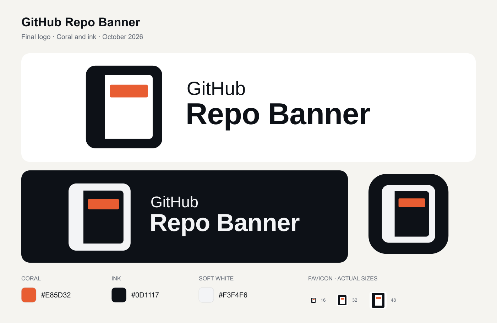

# Brand assets

The GitHub Repo Banner identity is a notebook with a coral banner inside it. See the [brand guidelines](../../docs/brand.md) for the palette, clear space, sizes and usage.

## Choose an asset

| Use | Light background | Dark background |
| --- | --- | --- |
| Icon or avatar | [Symbol SVG](svg/symbol-color.svg) · [512 px PNG](png/symbol-color-512.png) | [Symbol SVG](svg/symbol-dark.svg) · [512 px PNG](png/symbol-dark-512.png) |
| Logo beside a two-line name | [Horizontal SVG](svg/horizontal-color.svg) · [1200 px PNG](png/horizontal-color-1200.png) | [Horizontal SVG](svg/horizontal-dark.svg) · [1200 px PNG](png/horizontal-dark-1200.png) |
| Logo above the name | [Stacked SVG](svg/stacked-color.svg) · [1200 px PNG](png/stacked-color-1200.png) | [Stacked SVG](svg/stacked-dark.svg) · [1200 px PNG](png/stacked-dark-1200.png) |
| Name only | [Wordmark SVG](svg/wordmark-color.svg) | [Wordmark SVG](svg/wordmark-dark.svg) |
| Icon below 32 px | [Small symbol SVG](svg/symbol-small-color.svg) | [Small symbol SVG](svg/symbol-small-dark.svg) |

- `svg/` contains the vector masters. The `black`, `white` and `coral` suffixes identify one-colour versions of each layout. Lettering is outlined, so no installed font is required.
- `png/` contains transparent raster exports, plus a [1024 px app icon](png/app-icon-1024.png) on an ink tile.
- `web/` contains the favicon SVG, ICO and 16/32/48 px PNGs; the 180 px Apple touch icon; 192/512 px app icons; a 512 px maskable icon; a manifest and an HTML integration snippet.
- [FONT-LICENSE.txt](FONT-LICENSE.txt) records the licence and attribution for Liberation Sans, used to create the lettering.

## Web integration

These are source assets for future integration. This directory is not served by the application automatically.

To use the supplied web set, copy the files from `web/` into the destination site's public asset directory. The [HTML snippet](web/head-snippet.html) and [manifest](web/site.webmanifest) assume those files are served from the site root; adjust both if using a different path. Review the manifest's app name, display mode and theme settings for the destination site.

The favicon has a white tile so it remains visible across browser themes. App icons use an ink tile with the soft-white notebook and coral banner. PNGs outside these tiled icons have transparent backgrounds.

The SVG files are the editable masters. When updating the identity, export matching raster/web files and keep the preview and guidelines in sync.
